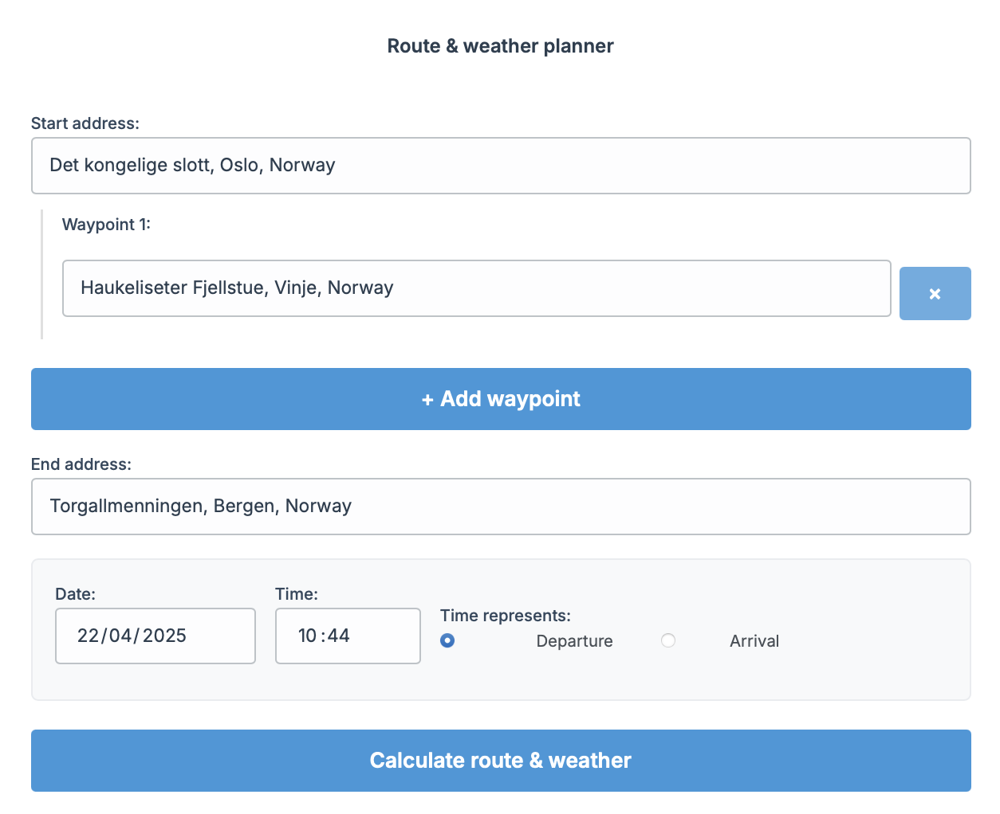

# Barvei 🚗💨🥶

**Plot your drive, see the freeze! Barvei helps you check the weather *along* your planned driving route, especially when you *really* don't want surprises involving snow and sub-zero temperatures.**

[](sh0t1.png)
[](sh0t2.png)

*(Click images to enlarge)*

---

## Why Tho? 🤔

Ever driven towards a Norwegian mountain pass in October, humming happily, only to discover Jack Frost decided *today* was the day to reclaim his icy throne? 🇳🇴❄️ We've all been there (or nervously anticipated it). Summer tires on surprise snow and ice is a recipe for... well, let's just call it an "Unscheduled Winter Adventure".

Standard weather apps tell you the weather *here* or *there*, but what about the 500km stretch *between* here and there, especially when elevation changes dramatically? What if it's +5°C at the start but plunges to -3°C precisely when you hit that notoriously sketchy mountain crossing halfway through?

## The Solution: Barvei ✨

Barvei aims to bridge that gap. You give it:

1.  A **Start Address**
2.  An (optional) list of **Waypoints**
3.  An **End Address**
4.  Your planned **Departure** or **Arrival** time

It then:

1.  Calculates the fastest driving route using OpenRouteService.
2.  Figures out *when* you're estimated to be at various points along that route.
3.  Fetches the weather forecast from the lovely folks at MET Norway (via the yr.no API) for those specific locations *at those specific future times*.
4.  Displays the route on a map and shows you a timeline of key weather points, focusing on changes. If the weather's boringly consistent, it just shows start and end. If it changes (especially temperature!), it shows you intermediate points (up to 5 total for clarity).

The main goal? To give you a heads-up if conditions are likely to change significantly, particularly dropping below freezing, so you can make smarter decisions about your trip, your tires, and maybe packing that extra emergency chocolate bar.

## Key Features 📋

*   **Route Planning:** Calculates fastest driving routes between Start, optional Waypoints, and End addresses.
*   **Address Autocomplete:** Suggests addresses as you type (powered by OpenRouteService).
*   **Waypoint Support:** Add multiple stops along your journey.
*   **Future Planning:** Plan trips based on a specific departure or arrival date/time.
*   **Route Weather Timeline:** Displays weather forecast data (temperature, symbol) for up to 5 key points along the route based on calculated arrival times.
*   **Dynamic Weather Points:** Only shows intermediate weather points if conditions (temperature, weather symbol) actually change along the route.
*   **Map Visualization:** Shows the calculated route and weather point markers on an OpenStreetMap base layer using Leaflet.
*   **Internationalization (i18n):** Currently supports English (en), Norwegian (no), and Spanish (es).
*   **Focus on Temperature:** Designed with Norwegian conditions in mind, helping to spot potential freezing temperatures or significant drops.

## Tech Stack 🛠️

*   **Framework:** Next.js (App Router)
*   **Hosting:** Cloudflare Pages
*   **Mapping:** Leaflet & React Leaflet
*   **Routing & Geocoding:** OpenRouteService API
*   **Weather Data:** MET Norway / yr.no Locationforecast API
*   **Styling:** CSS Modules
*   **Language:** TypeScript
*   **i18n:** `next-intl`

## Getting Started 🚀

Want to run this locally? Sure, why not!

1.  **Clone the repo:**
    ```bash
    git clone https://github.com/torfinnnome/barvei.git
    cd barvei
    ```
2.  **Install dependencies:**
    ```bash
    npm install
    # or yarn install, or pnpm install
    ```
3.  **Set up Environment Variables:**
    Create a `.env.local` file in the root directory with your API keys:
    ```.env.local
    # Get a free key from https://openrouteservice.org/dev/#/signup
    ORS_API_KEY=your_openrouteservice_api_key_here

    # See MET Norway API docs: https://api.met.no/weatherapi/locationforecast/2.0/documentation
    # MUST uniquely identify your application. Format: AppName/Version ContactInfo(email/repo)
    NEXT_PUBLIC_YR_USER_AGENT=MyBarveiFork/0.1 myemail@example.com
    ```
    **Note:** The `NEXT_PUBLIC_YR_USER_AGENT` is technically safe to expose client-side, but it's good practice to keep API interactions backend-only where possible. The current implementation uses it in the backend API route.

4.  **Run the development server:**
    ```bash
    npm run dev
    ```
5.  Open [http://localhost:3000](http://localhost:3000) in your browser.

## Future Ideas / Contributing 🤔

This was built primarily for personal use, but hey, maybe it's useful for others! Potential future improvements:

*   Drag-and-drop reordering of waypoints.
*   Displaying more weather info (wind speed, precipitation type/amount).
*   Showing an elevation profile alongside the weather.
*   Saving/loading common routes.
*   More robust error handling.
*   UI for selecting different routing profiles (e.g., shortest).

Feel free to fork, submit issues, or suggest improvements!

## Disclaimer ⚠️

Barvei relies on third-party APIs (ORS, MET Norway) and forecasts. Forecasts can be wrong, routing estimates might not account for traffic or sudden closures, and this app is **no substitute for checking official road status reports (like Statens Vegvesen in Norway) and using common sense.** Don't drive into a blizzard just because an app said it *might* be okay hours ago. Drive safely!

---

*Built because sometimes you just want to know if you need winter tires halfway to Bergen.*
